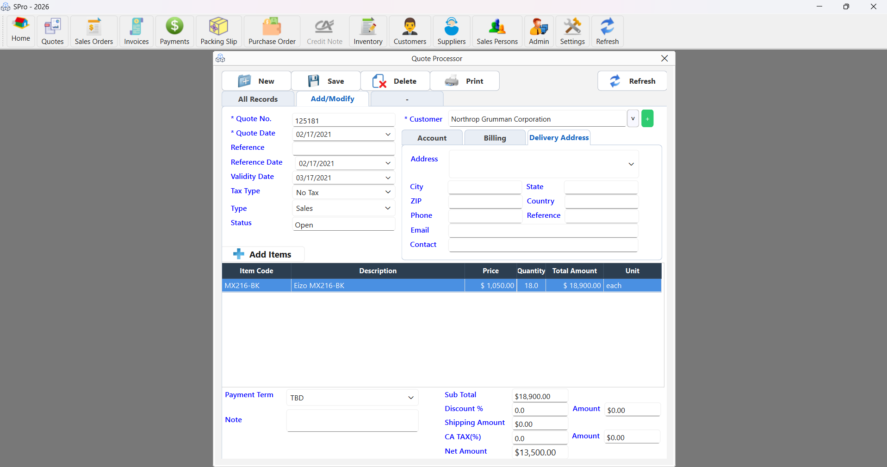
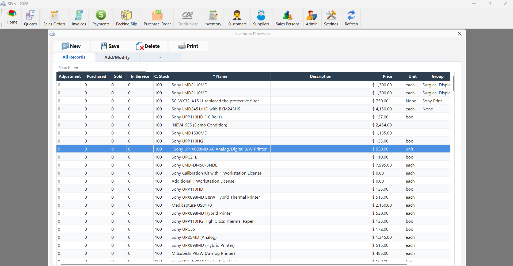

# SalesProcessor

### Complete Desktop Sales, Inventory & Business Management Software

**SalesProcessor** is a modern desktop business management application designed to simplify **sales, purchasing, inventory, customers, quotations, orders, invoicing, and business records** in one place.

Built with **Python, PySide6, and SQLite**, SalesProcessor is designed to be fast, practical, and easy to use for small and medium-sized businesses.

---

## 🚀 Why SalesProcessor?

Managing customers, products, purchases, sales, and inventory across multiple systems can be complicated.

SalesProcessor brings these everyday business operations together into a single desktop application.

**One application. One database. One place to manage your business.**

---

## ✨ Features

### 👥 Customer Management

* Customer registration and management
* Customer contact information
* Multiple delivery addresses
* Payment terms
* Customer-specific sales history
* Customer-related records

### 📦 Item & Inventory Management

* Item/product management
* Item codes and descriptions
* Selling and purchase prices
* Stock quantity tracking
* Weight and measurement units
* Item sales history
* Item purchase history
* Inventory-related information

### 🧾 Quotations

* Create and manage quotations
* Customer-based quotations
* Quotation dates and references
* Due dates
* Tax configuration
* Convert quotation information into further sales workflows

### 📋 Sales Orders

* Create sales orders
* Customer order management
* Order dates and references
* Order tracking
* Sales order history

### 💰 Invoicing

* Create customer invoices
* Invoice numbering
* Invoice dates
* Customer information
* Payment tracking
* Outstanding balances
* Manual payments
* Receipt payments
* Due amount tracking

### 🛒 Purchasing

* Purchase transaction management
* Supplier-related purchase records
* Purchase history
* Item-level purchase tracking
* Purchase quantities and prices

### 📊 History & Reporting

View detailed transaction history for:

* Items
* Customers
* Sales
* Purchases
* Invoices
* Orders
* Quotations

Analyze what was purchased, what was sold, when it happened, and at what price.

### 📑 Excel Import & Export

SalesProcessor supports Excel-based data workflows.

* Export business data to Excel
* Import item and other master data
* Header-based Excel column mapping
* Flexible column order
* Support for additional Excel columns
* Existing records can be updated
* New records can be inserted

This makes it easy to migrate or maintain large amounts of business data.

### ⚙️ Flexible Basic Inputs

SalesProcessor supports configurable business master tables.

This allows different types of business information to be maintained without requiring a completely separate screen for every table.

### 🏢 Multi-Company Support

SalesProcessor is designed with company-level data separation.

Business records can be associated with a specific company, helping keep data separated when multiple companies are managed within the system.

---

# 🖥️ Technology

SalesProcessor is built using:

| Technology | Purpose                 |
| ---------- | ----------------------- |
| Python     | Application development |
| PySide6    | Desktop user interface  |
| Qt         | UI framework            |
| SQLite     | Database                |
| OpenPyXL   | Excel import/export     |

---

# 📸 Screenshots

Add screenshots of the application here.

### Dashboard


### Quotation Management



### Customer Management


### Item Management



### Invoice Management


### Item Sales & Purchase History


> Replace these image paths with your actual screenshots.

---

# 📦 Installation

## Windows

Download the latest SalesProcessor installer from the **Releases** section.

After installation, launch:

```text
SalesProcessor
```

## From Source

If you are running the project from source:

```bash
git clone https://github.com/YOUR_USERNAME/SalesProcessor.git
cd SalesProcessor
```

Create a virtual environment:

```bash
python -m venv .venv
```

Activate it on Windows:

```bash
.venv\Scripts\activate
```

Install dependencies:

```bash
pip install -r requirements.txt
```

Run the application:

```bash
python main.py
```

---

# 📋 System Requirements

Recommended:

* Windows 10 or later
* Python 3.10+
* 4 GB RAM or more
* SQLite

The compiled Windows version does not require the user to install Python separately.

---

# 🔐 Data

SalesProcessor uses SQLite for local data storage.

This provides:

* Fast local database access
* Simple deployment
* No database server required
* Easy backup
* Suitable for standalone desktop installations

**Always maintain regular backups of your business database.**

---

# 🎯 Who Is SalesProcessor For?

SalesProcessor is intended for businesses such as:

* Retail businesses
* Wholesale businesses
* Distributors
* Trading companies
* Small manufacturers
* Service businesses with product sales
* Small and medium-sized businesses

---

# 🛠️ Development Status

SalesProcessor is actively being developed.

New features, improvements, reporting capabilities, and workflow enhancements are being added over time.

---

# 🗺️ Roadmap

Planned improvements may include:

* [ ] Advanced sales reports
* [ ] Advanced purchase reports
* [ ] Profit & loss analysis
* [ ] Stock valuation
* [ ] Low-stock alerts
* [ ] More financial reports
* [ ] Enhanced dashboard
* [ ] PDF reporting improvements
* [ ] Additional Excel workflows
* [ ] Automated database backup
* [ ] Improved user permissions
* [ ] Cloud/remote database support

---

# 💼 Commercial Software

SalesProcessor can be provided as a commercial business application.

For:

* Product demonstrations
* Licensing
* Customization
* Business-specific features
* Installation
* Technical support

please contact the developer.

---

# 📞 Contact

**SalesProcessor**

For demonstrations, licensing, customization, and support:

📧 **Email:** [nsmbdmcsp@gmail.com](mailto:nsmbdmcsp@gmail.com)

🌐 **Website:** YOUR_WEBSITE

---

# ⭐ Support the Project

If you find SalesProcessor useful, consider giving the repository a ⭐ star.

Your feedback and suggestions are welcome.

---

## 📄 License

Copyright © 2026 SalesProcessor.

All rights reserved.

Unless otherwise stated, the SalesProcessor source code, application, database structure, branding, and associated materials may not be copied, modified, redistributed, or commercially used without permission.

---

### SalesProcessor

**Simplify your sales. Manage your inventory. Grow your business.**
